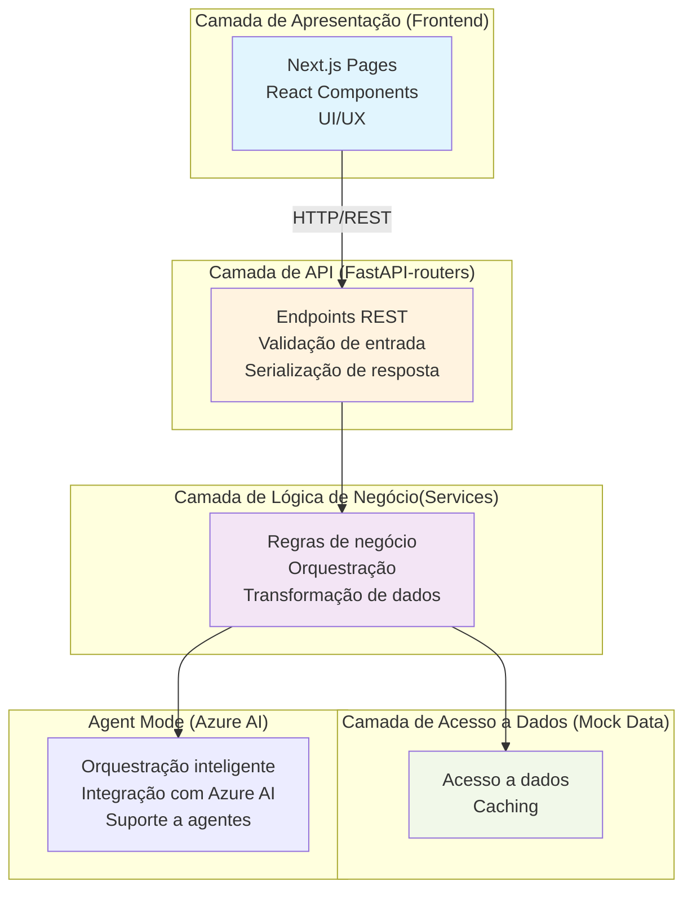
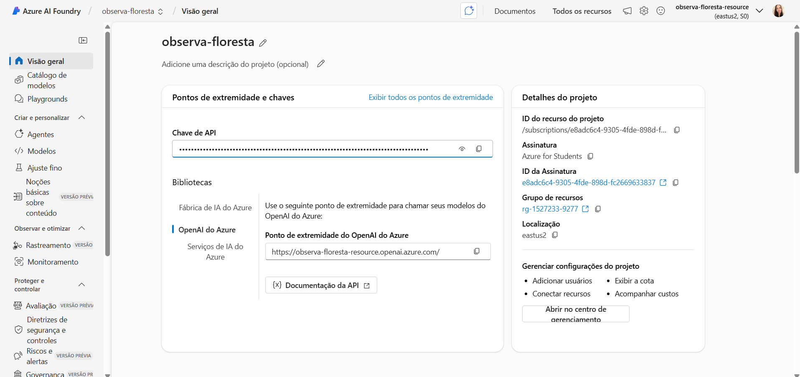
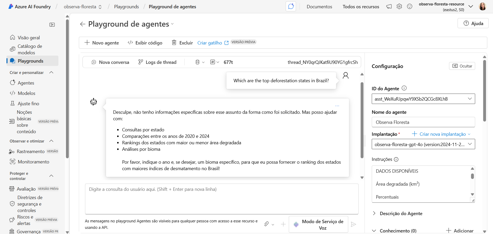
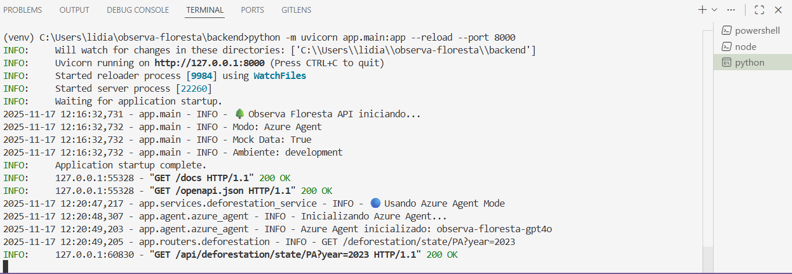
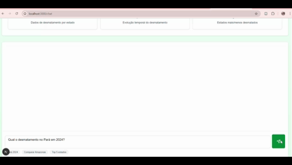

# 🌳 Observa Floresta

Sistema de monitoramento de desmatamento nos biomas brasileiros utilizando Azure AI Foundry e análise de dados ambientais.

## 🎯 Sobre o Projeto

Este projeto foi desenvolvido como parte do **Azure Frontier Girls 2025**.

O Observa Floresta é um agente inteligente que permite consultar, comparar e analisar dados de desmatamento dos biomas brasileiros, utilizando dados públicos do INPE, IBGE e MapBiomas.

## 🏗️ Arquitetura

O projeto utiliza uma arquitetura híbrida:

- **Agent Mode**: Utiliza Azure AI Foundry para processamento de linguagem natural
- **Direct Mode**: Lógica implementada diretamente no backend (para desenvolvimento e economia de custos)



### Arquitetura Híbrida: Direct vs Agent Mode

**Problema Identificado:**

Durante desenvolvimento, usar Azure AI Foundry constantemente resultaria em:
- 💰 Custos elevados ($20-30 apenas em testes)
- 🐛 Dificuldade de debug

### Stack Tecnológica

**Backend:**
- Python 3.12.x
- FastAPI
- Azure AI Foundry
- Pandas 

**Frontend:**
- Next.js 16 
- TypeScript
- Tailwind CSS
- Recharts 

## 🚀 Como Executar

### Pré-requisitos

- Python 3.12.x
- Node.js 18+
- Conta Azure (para modo Agent)

### Backend
```bash
cd backend
python -m venv venv
venv\Scripts\activate.bat
pip install -r requirements.txt
cp .env.example .env
python -m uvicorn app.main:app --reload --port 8000
```

### Frontend
```bash
cd frontend
npm install
npm run dev
```

### Testes
```bash
cd backend
python test_endpoints.py
```

### Modes de Execução

No arquivo `.env` você escolhe entre dois modos:

- **Direct Mode**  
```
USE_AZURE_AGENT=false
```
Usa apenas serviços internos (mock). Ideal para desenvolvimento e debug, sem custo.

- **Agent Mode (Azure AI)**  
```
USE_AZURE_AGENT=true
```
Ativa integração com Azure AI Agents. Mais inteligente, mas gera custos e é mais complexo.

## 📊 Funcionalidades

### 3 Ações Principais:

1. **Consulta por Estado**: Dados de desmatamento de um estado específico
2. **Comparação Temporal**: Análise de tendências ao longo dos anos
3. **Ranking de Estados**: Estados mais/menos desmatados

## 🎓 Decisões Técnicas

### 📊 Sobre os Dados

#### Fontes de Dados

Os dados utilizados neste projeto são **baseados em fontes oficiais**:
- **INPE** (Instituto Nacional de Pesquisas Espaciais) - TerraBrasilis
- **IBGE** (Instituto Brasileiro de Geografia e Estatística)
- **MapBiomas** - Plataforma de dados ambientais

#### Implementação Atual

Para fins de **demonstração e desenvolvimento**, o sistema utiliza dados mockados que:

- **Refletem tendências reais** observadas nos últimos anos  
- **Mantêm proporções realistas** entre estados e biomas  
- **Seguem padrões históricos** de 2020-2024  
- **São consistentes** com relatórios oficiais publicados

## 📸 Screenshots


<br><br>
Figura 1. Azure AI Foundry - Projeto criado
<br>

---

<br><br>
Figura 2. Agente deployado
<br>

---

<br><br>
Figura 3. Página de credenciais
<br>

---

<br><br>
Figur 4. Playground – fornecendo uma pergunta em inglês (o agente foi configurado para responder apenas em português)
<br>

---

<br><br>
Figura 5. Terminal com Azure Agent Mode
<br>

---

<br><br>
Figura 6. Swagger com resposta do agent. [Video](docs/Screenshots/swagger_agent.mp4)
<br>

---


<br><br>
Figura 6. Chat com agent
<br>

---

<br><br>
Figura 7. Aplicação Web. [Video](docs/Screenshots/aplicacao_web.mp4)
<br>

---
[Video](docs/Screenshots/chat_video.mp4)
<br><br>
Video 1. Chat no Direct Mode.

---

## 📝 Licença

MIT

## 👩‍💻 Autora

Raianne Martins

## Referências

- [Azure AI Foundry](https://learn.microsoft.com/azure/ai-services/)  
- [Power Automate](https://learn.microsoft.com/power-automate/)  
- [MapBiomas](https://mapbiomas.org/)  
- [INPE – TerraBrasilis](http://terrabrasilis.dpi.inpe.br/)  
- [IBGE](https://www.ibge.gov.br/)  
